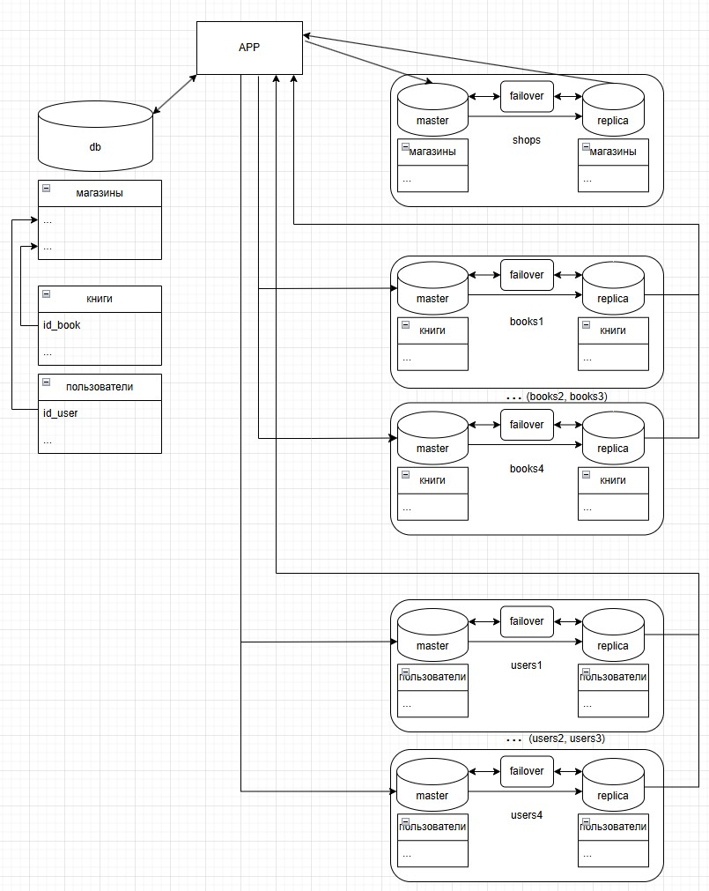

# Домашнее задание к занятию «Репликация и масштабирование. Часть 2» - Минин Александр

### Задание 1

Опишите основные преимущества использования масштабирования методами:

- активный master-сервер и пассивный репликационный slave-сервер; 
- master-сервер и несколько slave-серверов;

*Дайте ответ в свободной форме.*

### Решение 1

активный master-сервер и пассивный репликационный slave-сервер:
- увеличение производительности, так с мастера снимается нагрузка операций чтения
- повышение отказоустойчивости, при отказе мастера можно продолжать операции чтения

master-сервер и несколько slave-серверов:
- существенное повышение производительности за счет распределения чтения на несколько узлов
- высокая отказоустойчивость: один из слейвов может быть повышен до мастера.
---

### Задание 2

Разработайте план для выполнения горизонтального и вертикального шардинга базы данных. База данных состоит из трёх таблиц: 

- пользователи, 
- книги, 
- магазины (столбцы произвольно). 

Опишите принципы построения системы и их разграничение или разбивку между базами данных.

*Пришлите блоксхему, где и что будет располагаться. Опишите, в каких режимах будут работать сервера.* 

### Решение 2

Предполагаю создать три группы серверов:

Серверы для таблицы магазины: Это будет один кластер, работающий в режиме master-slave. Он не будет сильно масштабироваться, так как данные меняются редко.

Серверы для таблицы пользователи: Это будет отдельный кластер, состоящий из 4 шардов, каждый из которых работает в режиме master-slave.

Серверы для таблицы книги: Аналогично, это будет отдельный кластер из 4 шардов, каждый в режиме master-slave.

В итоге мы получим:

1. Вертикальное шардирование: 

Мы разделим нашу базу данных по таблицам: магазины на одном наборе серверов, а пользователи и книги — на другом.

2. Горизонтальное шардирование: 

Для таблиц пользователи и книги мы используем горизонтальное масштабирование, распределяя данные по 4 шардам (серверам) на основе id_user и id_book используя хеш.

3. Репликация (Master-Slave): 

Каждый шард в нашей системе работает в режиме master-slave. 

Это позволяет: Мастеру обрабатывать все операции записи. Слейвам обрабатывать операции чтения, существенно повышая производительность.

4. Отказоустойчивость: 

Для каждого шарда мы предусмотрели механизм автоматического failover. Если мастер выходит из строя, один из слейвов автоматически повышается до его роли, обеспечивая непрерывность работы.

## Дополнительные задания (со звёздочкой*)
Эти задания дополнительные, то есть не обязательные к выполнению, и никак не повлияют на получение вами зачёта по этому домашнему заданию. Вы можете их выполнить, если хотите глубже шире разобраться в материале.

---
### Задание 3*

Выполните настройку выбранных методов шардинга из задания 2.

*Пришлите конфиг Docker и SQL скрипт с командами для базы данных*.
